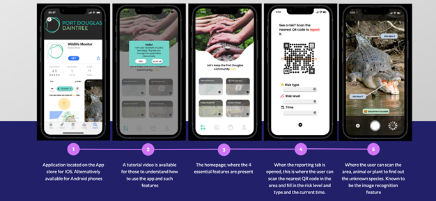

# Wildlife-Monitor-Application
An interactive prototype of a dangerous wildlife monitoring application built using Figma for the 2022 Engineers Without Borders Challenge.

The proposed application was intended to be used by the residents of the Cairns/Port Douglas region of Northern Queensland to report and monitor for sightings of the dangerous local wildlife.

A full report on the proposed application was created and presented - reach out for more information :)

Try out the prototype here: [Figma](https://www.figma.com/proto/9QSrBNLIllbBQ9WnNJUbE8/Design-1?node-id=145-79&scaling=scale-down&page-id=0%3A1&starting-point-node-id=145%3A79)

  

## Features

  

  

  

